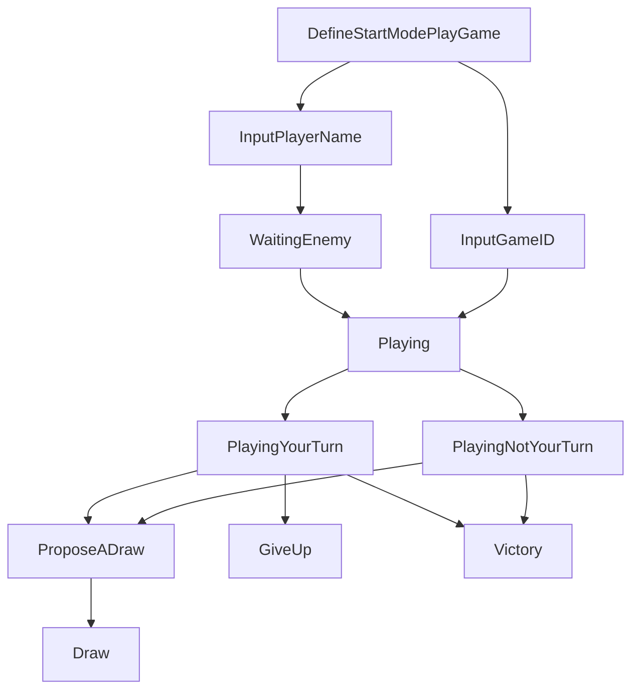

## Definition de la machine et de ses états

```mermaid
flowchart TD
A[DefineStartModePlayGame]
A --> B[InputPlayerName]
A --> C[InputGameID]
B --> D[WaitingEnemy]
D --> E[Playing]
C --> E

E --> F[PlayingYourTurn]
E --> G[PlayingNotYourTurn]

F --> H[ProposeADraw]
G --> H
H --> I[Draw]

F --> J[GiveUp]
F --> K[Victory]
G --> K
```
